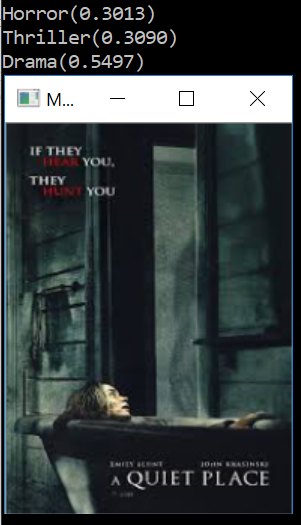

# Movie Genre Classification based on Poster


This projects focuses on predicting the genres of the movie based on the movie poster. The [data set](https://www.kaggle.com/neha1703/movie-genre-from-its-poster/metadata) contains information about 39515 movies including their posters and genres. Each movie can have as much as 3 out of 27 genres which makes this a multi-label classification problem. The project classified only movies that came out after the year 2000. Convolutional Neural Network was used to train the classificator and Hamming loss, One-rank loss and Coverage were used to estimate the performance of the model.


## Prerequisites 

* numpy
* pandas
* tensoflow
* keras 

## Model

```py
Layer (type)                 Output Shape              Param #   
=================================================================
conv2d_1 (Conv2D)            (None, 222, 222, 32)      896       
_________________________________________________________________
max_pooling2d_1 (MaxPooling2 (None, 111, 111, 32)      0         
_________________________________________________________________
dropout_1 (Dropout)          (None, 111, 111, 32)      0         
_________________________________________________________________
conv2d_2 (Conv2D)            (None, 109, 109, 64)      18496     
_________________________________________________________________
max_pooling2d_2 (MaxPooling2 (None, 54, 54, 64)        0         
_________________________________________________________________
dropout_2 (Dropout)          (None, 54, 54, 64)        0         
_________________________________________________________________
conv2d_3 (Conv2D)            (None, 52, 52, 128)       73856     
_________________________________________________________________
max_pooling2d_3 (MaxPooling2 (None, 26, 26, 128)       0         
_________________________________________________________________
dropout_3 (Dropout)          (None, 26, 26, 128)       0         
_________________________________________________________________
flatten_1 (Flatten)          (None, 86528)             0         
_________________________________________________________________
dense_1 (Dense)              (None, 128)               11075712  
_________________________________________________________________
dropout_4 (Dropout)          (None, 128)               0         
_________________________________________________________________
dense_2 (Dense)              (None, 27)                3483      
=================================================================
Total params: 11,172,443
Trainable params: 11,172,443
Non-trainable params: 0
_________________________________________________________________
None
```

## Results

On the test data set model showed following results 
* Hamming Loss = 0.0753
* One-rank Loss = 0.4976
* Coverage = 7.5483


## Results demonstration


